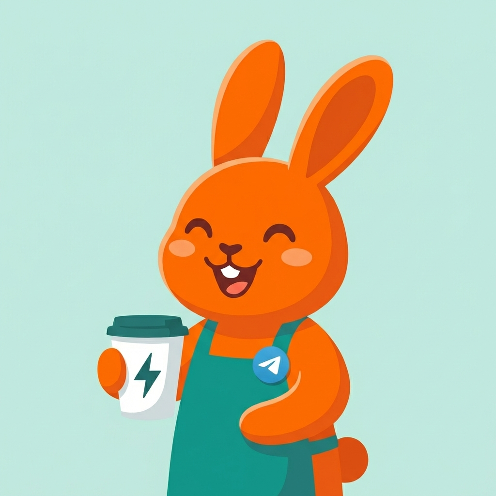
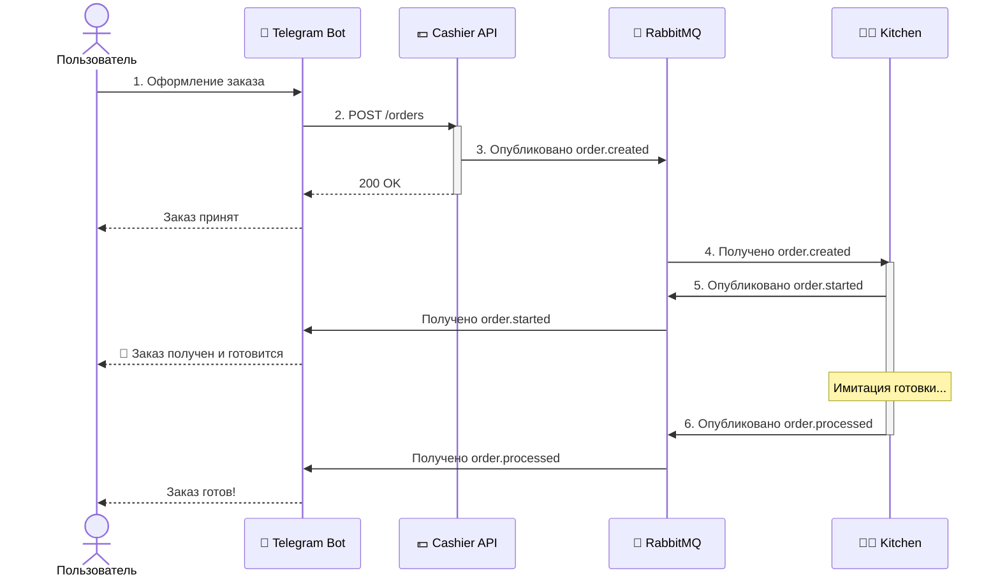

# FastStream Cafe 🐰☕️

<p align="center">
  
</p>

Учебный проект для освоения и демонстрации асинхронной микросервисной архитектуры на базе **RabbitMQ** и **FastStream**.
Проект имитирует работу кофейни: заказ через Telegram бота, обработка на бэкенде, асинхронная "готовка" в воркере и уведомления о начале готовки и готовности заказа.

## Структура проекта

Проект состоит из трёх микросервисов:

1.  **Cashier** (`FastAPI` + `FastStream`): HTTP API для приёма заказов. Публикует события в RabbitMQ.
2.  **Kitchen** (`FastAPI` + `FastStream`): Воркер (Consumer), который слушает очередь, "готовит" заказ (имитация задержки) и публикует статусы (`started`, `processed`).
3.  **Bot** (`aiogram` + `FastStream`): Интерфейс для пользователя. Отправляет заказы в API и слушает очередь уведомлений для отправки статусов пользователю.
4.  **Shared**: Общая библиотека с моделями данных, настройками логгера и константами очередей для всех сервисов.

## Схема работы



## Документация

- [Архитектура](docs/architecture.md)
- [Сервис Bot](bot/README.md)
- [Сервис Cashier](cashier/README.md)
- [Сервис Kitchen](kitchen/README.md)
- [Модуль Shared](shared/README.md)

## Стек

- **Python 3.13**
- **RabbitMQ 3**
- **FastAPI**
- **FastStream[rabbit]**
- **aiogram 3**
- **Docker** и **Docker Compose**

## Как запустить

1. **Склонируйте репозиторий:**

   ```bash
   git clone https://github.com/L4zzur/faststream-cafe-bot.git
   cd faststream-cafe-bot
   ```

2. **Настройка окружения:**
   - Создайте файл `.env` используя `.env.example`:
     ```bash
     cp .env.example .env
     ```
   - Откройте `.env` и укажите токен бота:
     ```env
     BOT_TOKEN=YOUR_BOT_TOKEN_HERE
     ```
   - По необходимости так же можно изменить порты сервисов.

3. **Запуск через Docker Compose:**

   ```bash
   docker-compose up -d --build
   ```

4. **Использование:**
   - Откройте бота в Telegram.
   - Используйте команду `/start`.
   - Выберите товары, добавьте в корзину и оформите заказ.
   - Наблюдайте за статусами в чате и логами в терминале!
